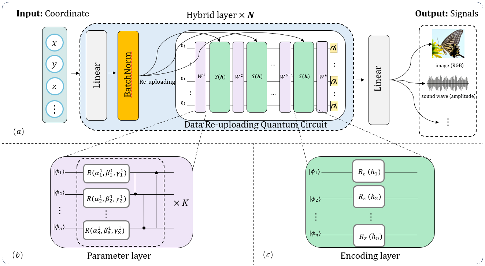

## QIREN: Quantum Implicit Neural Representations (ICML 2024)
This repo contains the code that was used in the paper "Quantum Implicit Neural Representations". qinr contains code for image representation and sound representation tasks, while inr-gan contains code for face generation tasks.

